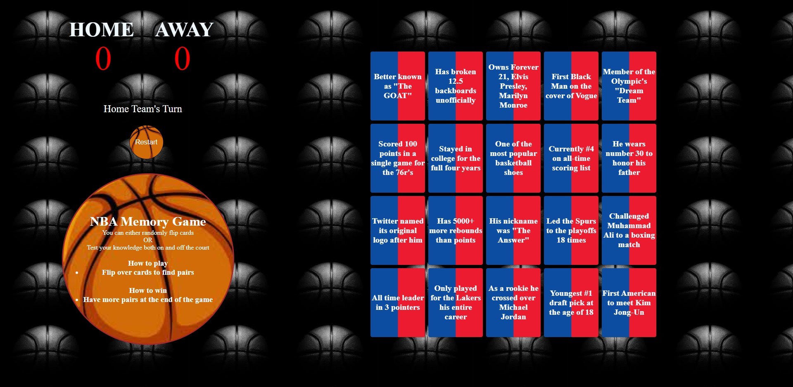

# NBA Memory Game 
NBA Memory Game is your simple memory game but with a twist. You can either flip cards by random or use the details on the front of the cards. Player with the most matches wins.

 
 

## Link To Game 
[MemoryGame](https://danielmorris710.github.io/Memory-Game/memory.html)

## Preview

 
 

## Game Play
Pick cards based off of pure luck or use details on the front.
Go back and forth until all cards have been matched up.

 
 

## User Stories
- Choose wether you are Home Team or Away Team
- Home Team always goes first
- Flip cards off of luck or details
- Learn some interesting facts about past and current NBA players 

 
 

## Technologies Used 
- HTML 5
- CSS 3
- JavaScript

 
 

## Future Plans For Rock Paper Scissors 
During this project, I realized there was so much more I wanted to do. 
 
 
A few things I would do to improve the players experience :
- Being able to select the first cards the previous player chose 
- Add a more players  
- A restart button to not have to refresh the page 
- Solo play mode against the computer
- Different levels